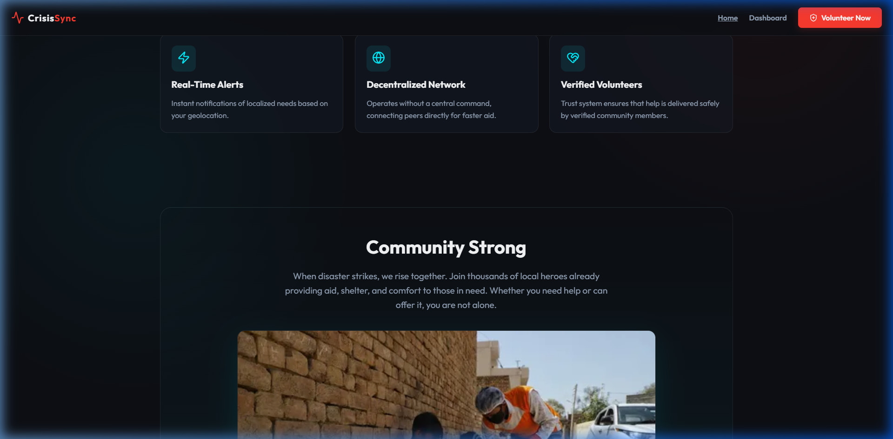
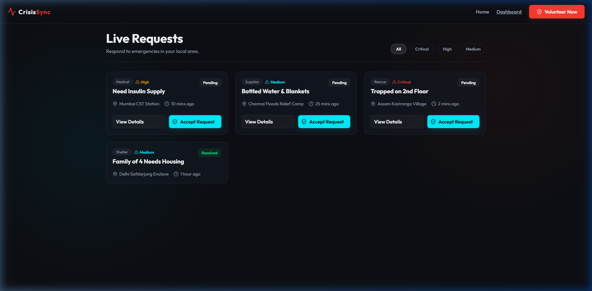
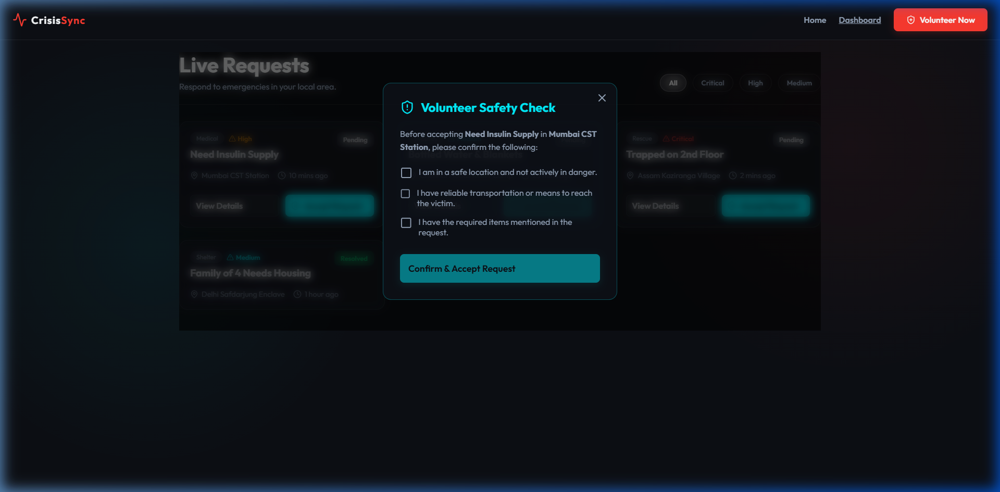
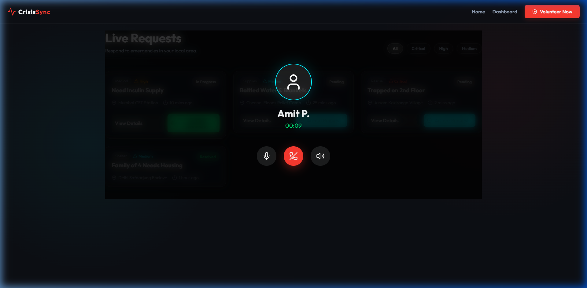

<div align="center">
  
  <h1>CrisisSync</h1>
  <p><strong>Decentralizing Emergency Response & Disaster Relief</strong></p>
  
  [](https://react.dev/)
  [](https://vitejs.dev/)
  [](https://opensource.org/licenses/MIT)
</div>

---

## 🌍 Overview

During a crisis, traditional emergency services are often overwhelmed. **CrisisSync** bridges the gap by providing a real-time, decentralized emergency relief network. Our platform instantly connects individuals who need help with verified local volunteers who can provide it—whether that's medical supplies, shelter, or rescue.

### ✨ Key Features

- **Real-Time Request Mapping**: Drop an SOS request detailing emergency type, urgency, and exact location.
- **Peer-to-Peer Volunteering**: Browse local pending requests ranging from 'Critical Rescue' to 'Medium Supplies'.
- **Volunteer Safety Checklist**: Built-in verification modal ensuring volunteers have required transport, safety parameters, and supplies before accepting dangerous tasks.
- **In-App VoIP Protocol (Mockup)**: Fast, secure contact interface generating an immediate digital connection between the victim and responder.
- **Glassmorphic Modern UI**: Premium, high-contrast aesthetics built for high visibility during stressful, split-second decision making.

## 🚀 Getting Started

To run the application locally on your machine, follow these steps:

### Prerequisites
- Node.js (v18+)
- npm or yarn

### Installation
1. **Clone the repository:**
   ```bash
   git clone https://github.com/CodeBeeny/CrisisSync.git
   cd CrisisSync
   ```

2. **Install dependencies:**
   ```bash
   npm install
   ```

3. **Start the development server:**
   ```bash
   npm run dev
   ```

4. **View the Application:**
   Open your browser and navigate to `http://localhost:5173`.

## 🛠 Tech Stack

- **Frontend Framework**: React 18
- **Build Tool**: Vite
- **Styling**: Vanilla CSS (Custom Glassmorphism Design System)
- **Icons**: Lucide React

## 📸 Screenshots


### Landing Page & Dashboard
<p align="center">
  
  
</p>

### Volunteer Checklist & VoIP Calling
<p align="center">
  
  
</p> Elevate your hackathon submission.

## 🤝 Contributing

Contributions, issues, and feature requests are welcome! Feel free to check the [issues page](https://github.com/CodeBeeny/CrisisSync/issues) if you want to contribute.

---

<div align="center">
  Built with ❤️ for rapid community-driven disaster relief.
</div>
